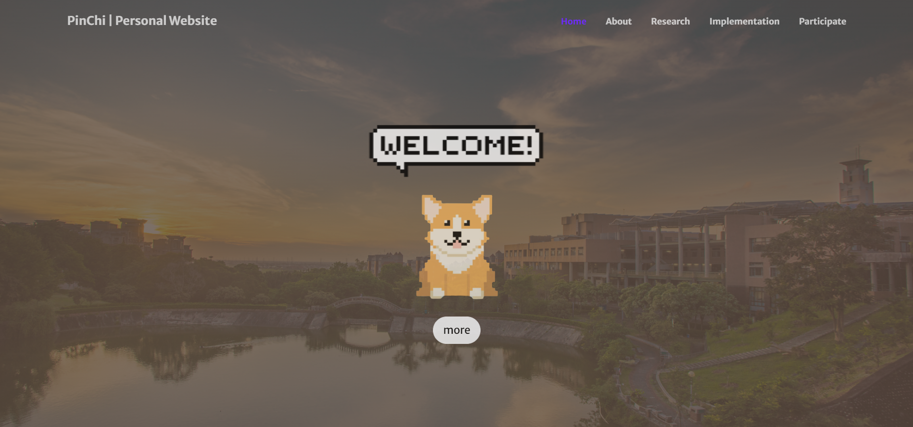

<h1>pinchi.github.io</h1>

<!-- Personal Website -->
<h2>Personal Website</h2>
<strong>URL: </strong>
<a href="https://panpinchi.github.io/personal_website" target="_blank">
  https://panpinchi.github.io/personal_website
</a>

<!-- Personal Website - About -->
<h2>Personal Website - About</h2>
<strong>URL: </strong>
<a href="https://panpinchi.github.io/personal_website/#about" target="_blank">
  https://panpinchi.github.io/personal_website/#about
</a>

<!-- Personal Website - Research -->
<h2>Personal Website - Research</h2>
<strong>URL: </strong>
<a href="https://panpinchi.github.io/personal_website/#research" target="_blank">
  https://panpinchi.github.io/personal_website/#research
</a>

<!-- Personal Website - Implementation -->
<h2>Personal Website - Implementation</h2>
<strong>URL: </strong>
<a href="https://panpinchi.github.io/personal_website/#implementation" target="_blank">
  https://panpinchi.github.io/personal_website/#implementation
</a>
<h3>Generative Adversarial Network</h3>
<ul>
  <li>
    <strong>URL: </strong>
    <a href="https://panpinchi.github.io/personal_website/gan.html" target="_blank">
      https://panpinchi.github.io/personal_website/gan.html
    </a>
  </li>
</ul>
<h3>AutoEncoder</h3>
<ul>
  <li>
    <strong>URL: </strong>
    <a href="https://panpinchi.github.io/personal_website/autoencoder.html" target="_blank">
      https://panpinchi.github.io/personal_website/autoencoder.html
    </a>
  </li>
</ul>
<h3>Image Recognition</h3>
<ul>
  <li>
    <strong>URL: </strong>
    <a href="https://panpinchi.github.io/personal_website/image_recognition.html" target="_blank">
      https://panpinchi.github.io/personal_website/image_recognition.html
    </a>
  </li>
</ul>
<h3>Others</h3>
<ul>
  <li>
    <strong>URL: </strong>
    <a href="https://panpinchi.github.io/personal_website/others.html" target="_blank">
      https://panpinchi.github.io/personal_website/others.html
    </a>
  </li>
</ul>

<h2>Personal Website - Participate</h2>
<strong>URL: </strong>
<a href="https://panpinchi.github.io/personal_website/#participate" target="_blank">
  https://panpinchi.github.io/personal_website/#participate
</a>
<h3>Activities</h3>
<ul>
  <li>
    <strong>URL: </strong>
    <a href="https://panpinchi.github.io/personal_website/activities.html" target="_blank">
      https://panpinchi.github.io/personal_website/activities.html
    </a>
  </li>
</ul>
<h3>Varsity</h3>
<ul>
  <li>
    <strong>URL: </strong>
    <a href="https://panpinchi.github.io/personal_website/varsity.html" target="_blank">
      https://panpinchi.github.io/personal_website/varsity.html
    </a>
  </li>
</ul>
<h3>Entrepreneurship</h3>
<ul>
  <li>
    <strong>URL: </strong>
    <a href="https://panpinchi.github.io/personal_website/ventrepreneurshiparsity.html" target="_blank">
      https://panpinchi.github.io/personal_website/entrepreneurship.html
    </a>
  </li>
</ul>
<h3>Competition</h3>
<ul>
  <li>
    <strong>URL: </strong>
    <a href="https://panpinchi.github.io/personal_website/competition.html" target="_blank">
      https://panpinchi.github.io/personal_website/competition.html
    </a>
  </li>
</ul>